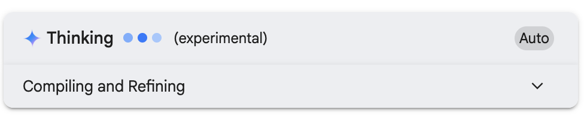
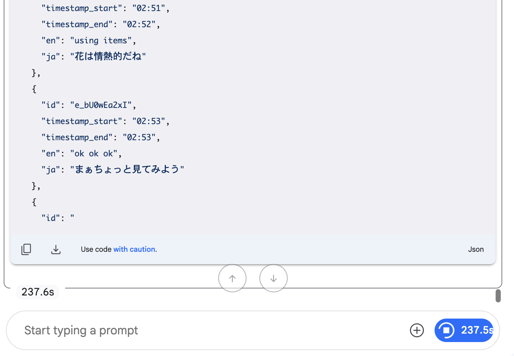
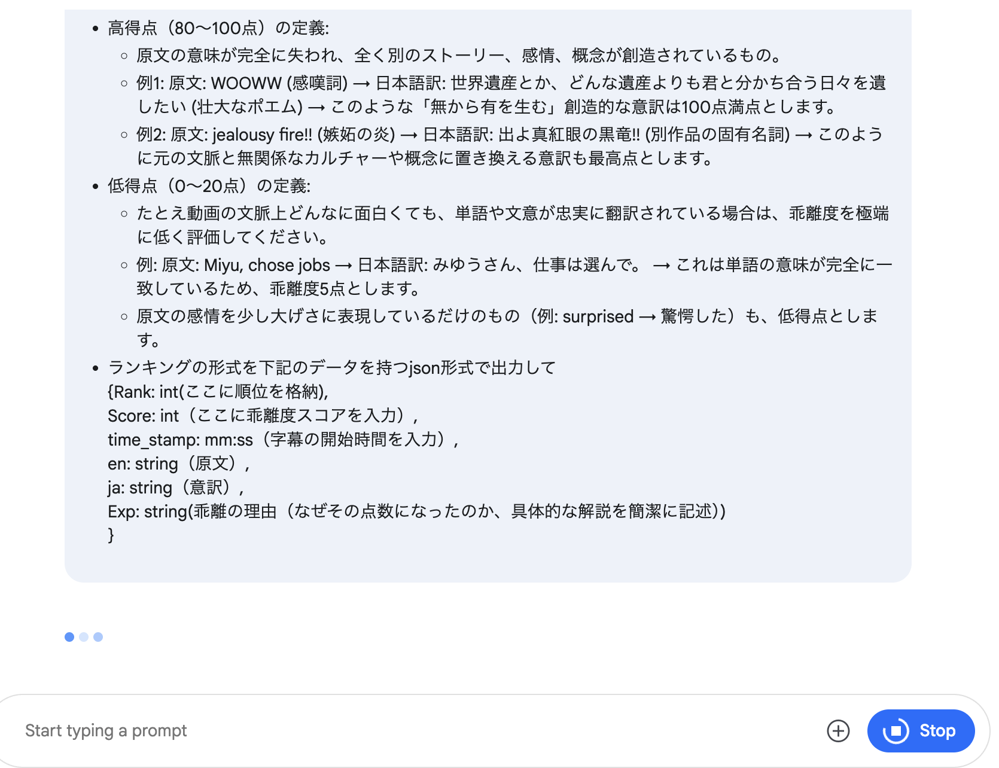
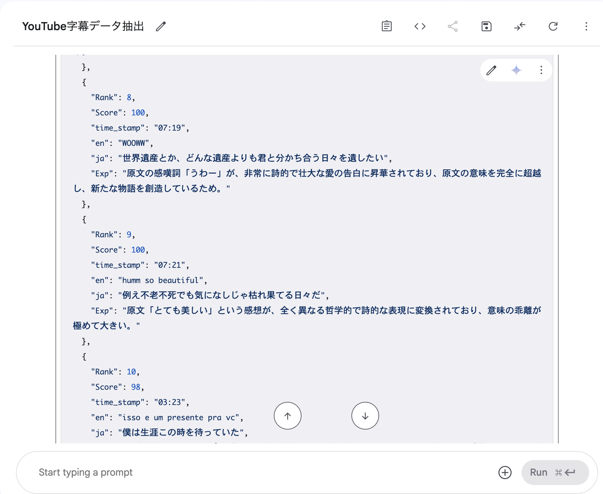

# Youtube動画から字幕を抜き出す

<!--
date = "2025-06-22"
-->

## 何ができるか

Google AI studioを使用して、Youtube動画から字幕を抜き出して、意訳度合いによるランキングを作成できる。

## 使うもの

- [Google AI studio](https://aistudio.google.com/prompts/new_chat)(無料)


## やり方

1. まず、Google AI studioで下記のプロンプトを入力し、実行する

```
{
"id": “ここに”Youtubeの一意IDを格納する,
"timestamp_start": 字幕の開始時間（例"00:08",）
"timestamp_end": 字幕の終了時間（例"00:08",）
"en": "Hello, world",
"ja": "こんにちは、世界"
},
添付したyoutubeから上記のようなjson形式で英語と日本語がペアになっているデータを取得してください。
動画内でポルトガル語が使用されていたら、ポルトガル語をenのところに格納してください
```

2. そうすると、このように何秒か考える


3. その後、json形式で結果が出力される


4. 出力が完了したら、下記のプロンプトを入力し、実行する

```
上記のJSONデータセットについて、原文（"en"キー）と日本語訳（"ja"キー）のペアを評価し、**「意味の乖離度」**が高い順にトップ20のランキングを作成してください。
【評価基準】
* 評価の核心: 原文と日本語訳の**「意味的な隔たり」**を絶対的な基準とします。元の単語や文法構造が、どれだけ異なる意味や概念に変換されているかを100点満点で採点してください。
* 高得点（80〜100点）の定義:
    * 原文の意味が完全に失われ、全く別のストーリー、感情、概念が創造されているもの。
    * 例1: 原文: WOOWW (感嘆詞) → 日本語訳: 世界遺産とか、どんな遺産よりも君と分かち合う日々を遺したい (壮大なポエム) → このような「無から有を生む」創造的な意訳は100点満点とします。
    * 例2: 原文: jealousy fire!! (嫉妬の炎) → 日本語訳: 出よ真紅眼の黒竜!! (別作品の固有名詞) → このように元の文脈と無関係なカルチャーや概念に置き換える意訳も最高点とします。
* 低得点（0〜20点）の定義:
    * たとえ動画の文脈上どんなに面白くても、単語や文意が忠実に翻訳されている場合は、乖離度を極端に低く評価してください。
    * 例: 原文: Miyu, chose jobs → 日本語訳: みゆうさん、仕事は選んで。 → これは単語の意味が完全に一致しているため、乖離度5点とします。
    * 原文の感情を少し大げさに表現しているだけのもの（例: surprised → 驚愕した）も、低得点とします。
* ランキングの形式を下記のデータを持つjson形式で出力して
    {Rank: int(ここに順位を格納),
    Score: int（ここに乖離度スコアを入力）,
    time_stamp: mm:ss（字幕の開始時間を入力）,
    en: string（原文）,
    ja: string（意訳）,
    Exp: string(乖離の理由（なぜその点数になったのか、具体的な解説を簡潔に記述）)
    }
```
5. このような出力が得られるはず 
